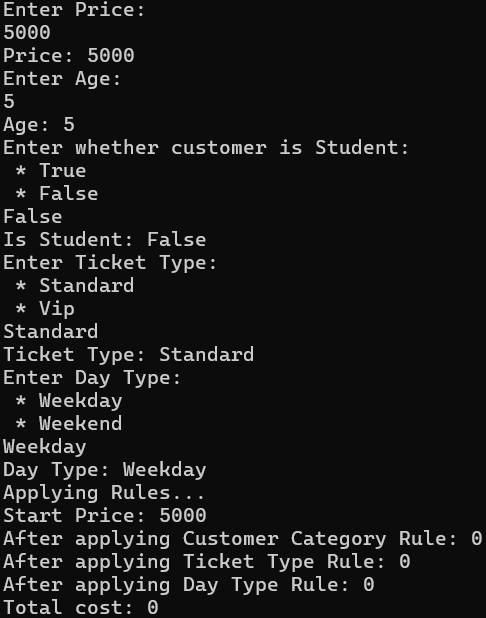
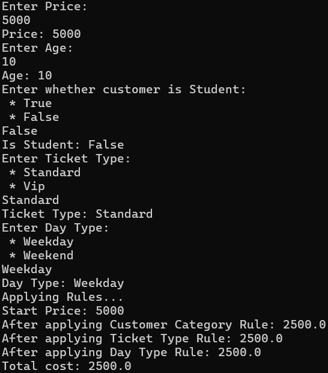
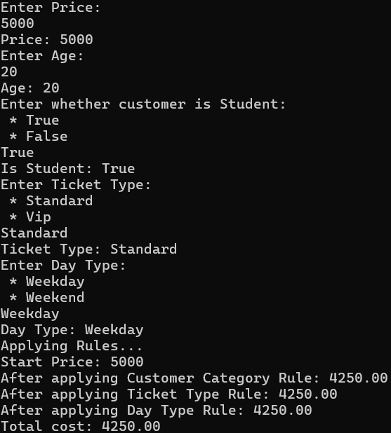
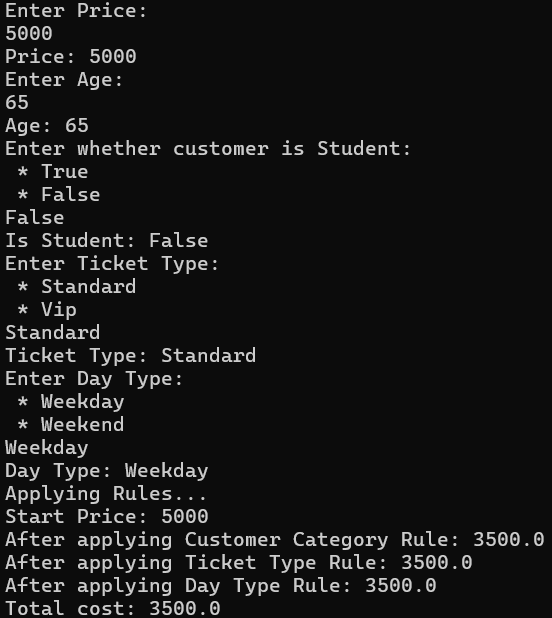
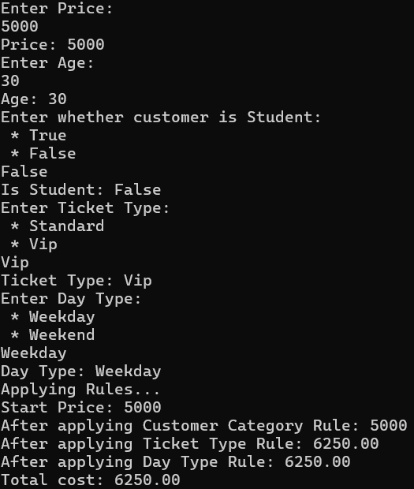
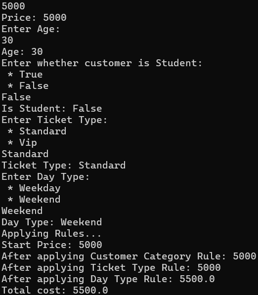

1.  Which parts of the program are imperative? (step-by-step control flow, console I/O)
The Main method
2.	Which functions are pure?
The following functions/lambdas are pure:
CustomerCategoryRule()
TicketTypeRule()
ApplyPricingRule()
dayTypeRule (lambda)
3.	Where do side effects remain?
inside Main (reading with Console.ReadLine() and writing via Console.WriteLine())
4.	Why is TryParse preferred to Parse for user input?
Prevents runtime exceptions on invalid user input by returning a bool instead

Test Cases:

